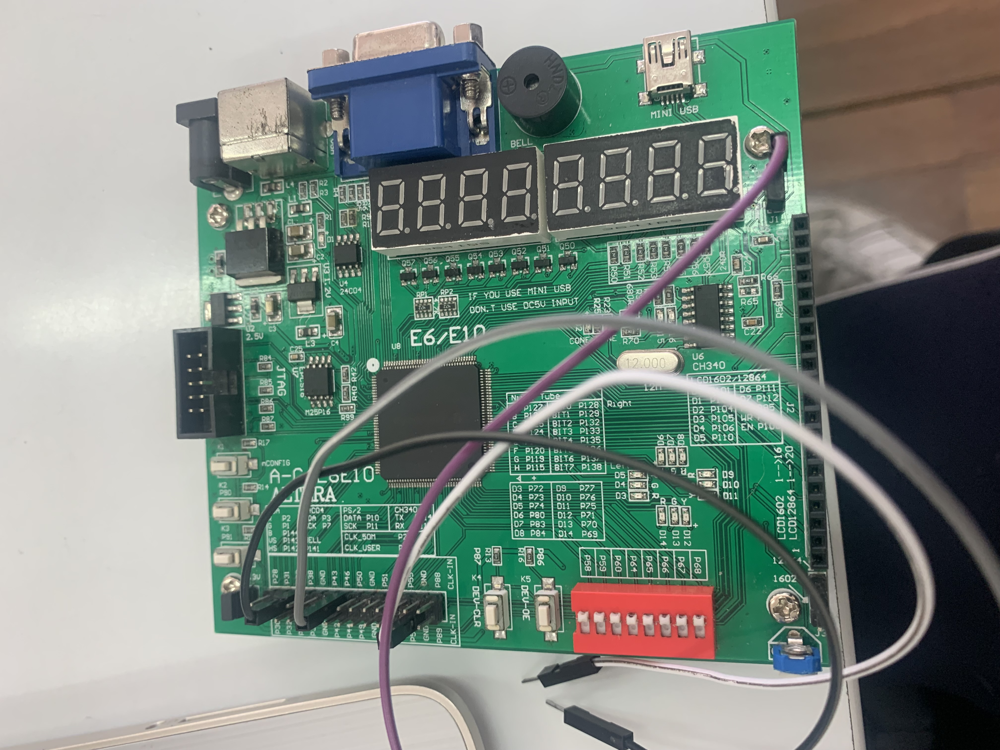
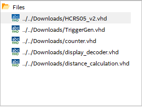
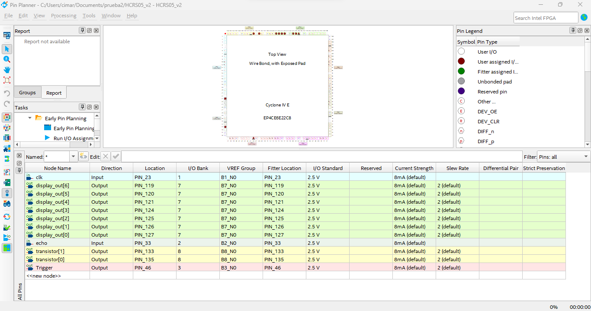
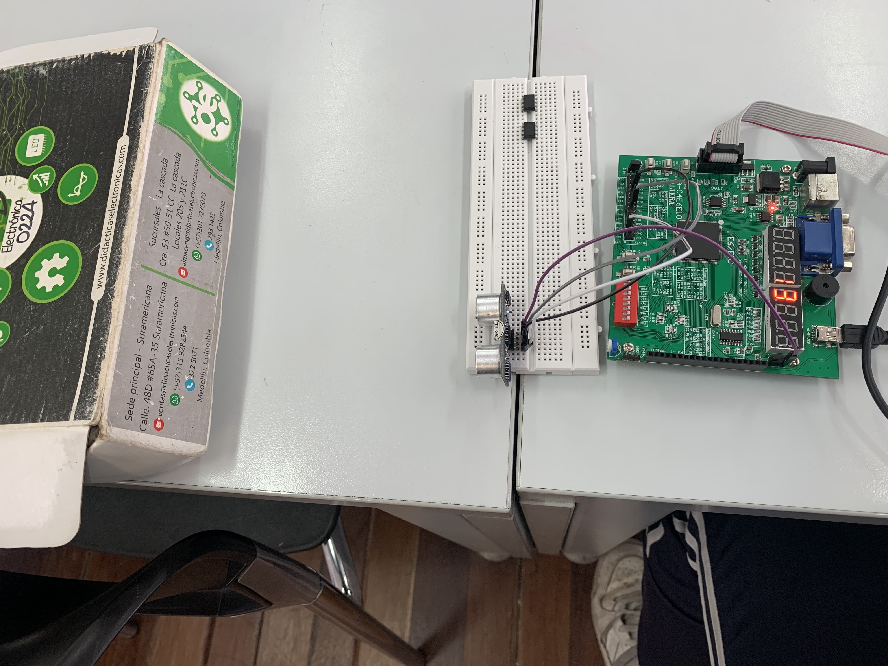

# Proyecto_Digital
Proyecto de la materia electronica digital I 

Profesor Magistral: Diego Alexander Tibaduiza Burgos - Grupo: 3

Profesor Laboratorio: Johnny Germán Cubides Castro 

Estudiante: _**JUAN PABLO LOPEZ MARTINEZ**_

## SEE-IT

## 1. Problematica a resolver

Muchas personas sordas o con dificultades para escuchar y que además de eso manejan un automóvil, a veces se les dificulta parquear y los nuevos sensores que nos avisan en la actualidad son con el sonido, cuando un objeto se encuentra, cerca de la parte trasera del carro.

## 2. Objetivo

El objetivo de este proyecto es la inclusión y la resolución de la problemática a estas personas, que muchas veces son marginadas y poco escuchadas, por medio del siguiente proyecto.

## 3. Desarrollo

El proyecto consta de dos periféricos, los cuales son un sensor de ultrasonido y la pantalla 7 segmentos, para que el afectado pueda visualizar en tiempo real a que distancia se encuentra del objeto trasero más cercano.  

Se hizo uso de conceptos como, contadores, librerías del sensor, lógica secuencial, máquinas de estados finitas, codificadores y decodificadores principalmente para la resolución de este. Se hizo uso del software de quartus y se utilizó la FPGA Cyclone IV.

## 4. Modulos utilizados

Para el desarrollo del proyecto se crearon 5 modulos vhdl con un top en donde cada uno consta de :

- Distance_calculation: Calcula la distancia aproximada a la que se encontrara el objeto. Realiza comparaciones en rangos específicos y asigna un valor de distancia, en función de esos rangos de valores.

- Diplay_decoder: Decodifica la distancia y la visualiza en un display de 7 segmentos. También contiene una máquina de estados se encarga de cambiar entre dos display y controlar los transistores.

- Counter: Implementa un contador ascendente con un tamaño especifico N. El contador se puede restablecer a cero mediante el “reset” y se incrementa en cada ciclo de reloj.  La salida q representa el valor actual del contador.

- TriggerGen: Genera un pulso de activación que tiene una duración de 500 clks después de cada reinicio.  Este módulo nos permite generar señales de activación temporizadas en sistemas digitales.

- HCRS05_v2: Este es muestro top, donde utiliza los módulos anteriores para medir una distancia con un sensor ultrasónico y mostrarlo en un display de 7 segmentos.

De igual forma, se adjunta el proyecto en la carpeta prueba2, con todos los codigos y simulaciones realizadas.

## 5. Plano de pines

Se adjunta el plano utilizado con los pines definidos del proyecto.

## 6. Simulacion y Resultados

Una vez realizado los modulos, se sinterizan y se compilan en el quartus; donde no obtuvimos ningun error, y se procede a subir el proyecto a la tarjeta altera.

Donde como podemos ver, el proyecto funciona correctamente.

De igual manera, se adjunta el diagrama RTL del proyecto.

## 7. Conclusiones

El diseño del proyecto podría plantearse en los carros modernos y es una solución para la gente con problemas de escucha o sordera. El apartado económico del proyecto es bastante viable por lo que es posible planteárselo a alguna compañía fabricadora de carros.

## 8. Anexos

Se adjunta el video del prototipo funcionando.

Se adjunta una presentacion explicando el proyecto de la asignatura planteado.

https://drive.google.com/file/d/1CStep5q2HHGl9DFznBeJ7BUN9g_N6xJY/view?usp=sharing
